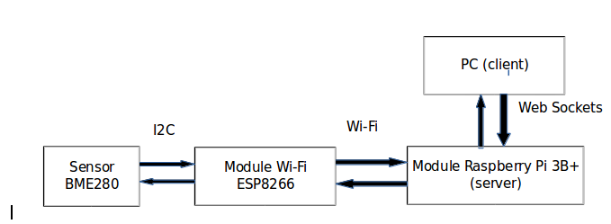

# Sprawozdanie z projektu ,,Inteligentne Systemy Pomiarowe”.

####Wykonawcy:
Bartosz Żbikowski 154791

Michał Camacho Romero 157185

**A) Main target of the project**

W ramach wykonywanego projektu został zaprojektowany, system pogodowy, dokonujący pomiaru 
temperatury, ciśnienia i wilgotności w czasie rzeczywistym. W celu wizualizacji zmierzonych danych, zaprojektowano API, 
za pomocą którego istniała możliwość wygenerowanie wykresów temperatury, wilgotności oraz ciśnienia. Do zaprojektowania
aplikacji webowej wykorzystano język programistyczny Node.js. 

#####B) Wykorzystane moduły:

* czujnik temperatury, wilgotności oraz ciśnienia BME280 I2C
* moduł Raspberry Pi 3B+
* moduł WIFI ESP8266 + NodeMCU

#####C) Schemat ideowy zaprojektowanego układu

#####D) Opis działania wykonanego układu

W celu dokonania odczytu danych pomiarowych tj.: temperatura, wilgotność, ciśnienie, wykorzystywany jest czujnik
BME280, podłączony po interfejsie I2C do modułu Wi-Fi ESP8266. Moduł ESP8266, przesyła zebrane dane po 
sieci bezprzewodowej do mikrokontrolera Raspberry Pi 3B+. Urządzenie Raspberry Pi pełni funkcję serwera aplikacji
webowej, służącej do wizualizacji zebranych próbek pomiarowych, w postaci wykresów liniowych. Komunikacja pomiędzy 
serwerem, a klientem, znajdującym się na komputerze odbywa się po protokole HTTP. W celu gromadzenia zebranych
danych, wykorzystano bazę danych MongoDb, umieszczoną w pamięci mikrokontrolera.

W przygotowanej aplikacji webowej są wykorzystywane w celu transmisji danych 2 rodzaje requests: GET (wizualizacja wykresów
na podstawie zmierzonych danych) oraz POST (przesyłanie danych pomiarowych z klienta (moduł WiFi) na serwer (Raspberry Pi).
 Moduł Wifi przesyła dane na serwer, z częstotliwością 1 próbki na sekundę. Dodatkowo z każdą odebraną daną, po stronie klienta, próbki są sprawdzane i usuwane, jeśli
 są one starsze niż 60 sekund. 

#####E) Rezultaty projektu

W ramach projektu zdołano:

* skonfigurować komunikację po interfejsie I2C, pomiędzy sensorem, a modułem Wifi
* skonfigurować komunikację bezprzewodową, pomiędzy modułem WiFi, a mikrokontrolerem Raspberry Pi
* przeprowadzić poprawny zapis i odczyt z bazy danych na serwerze
* zaimplementować możlwość wygenerowania wykresów pomiarowych, przez 
utworzone API
* zaprojektować strukturę serwe-klient w formie RestAPI

 

